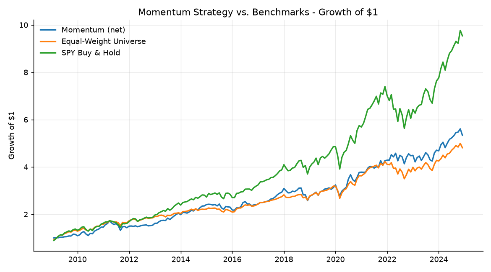
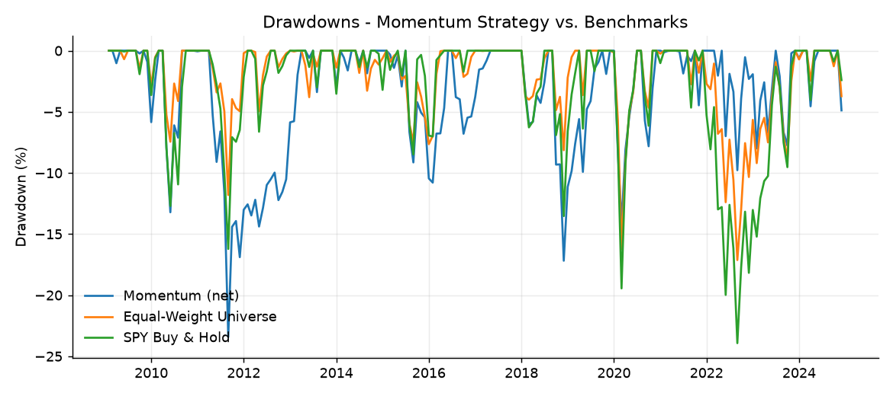
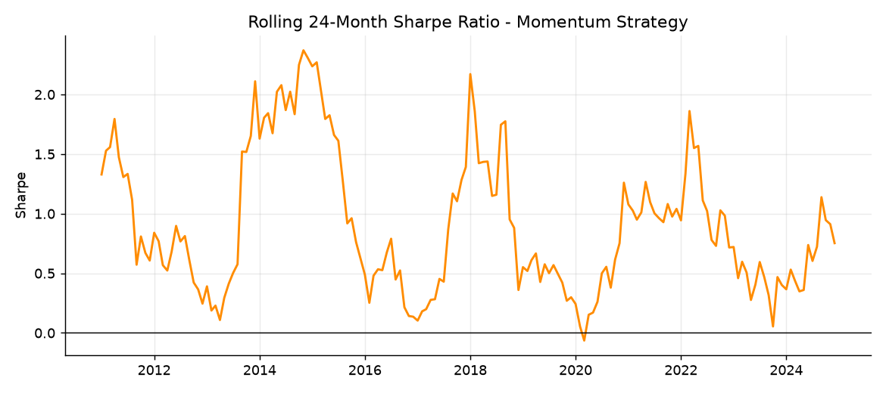
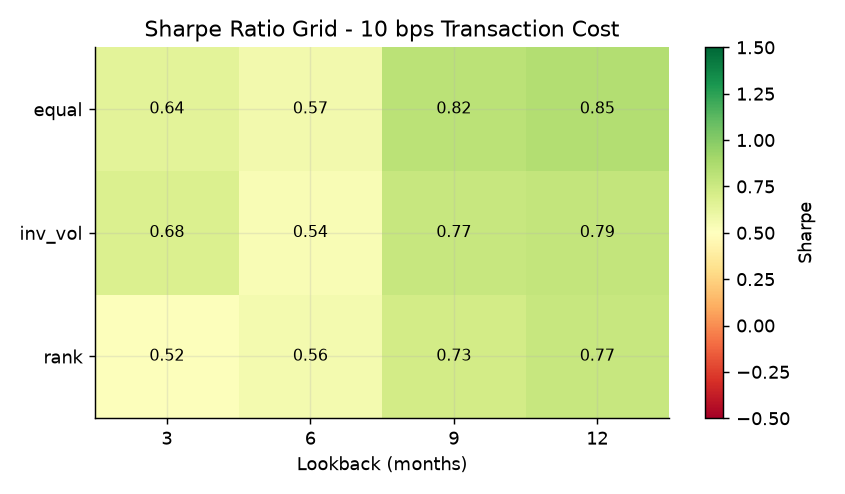
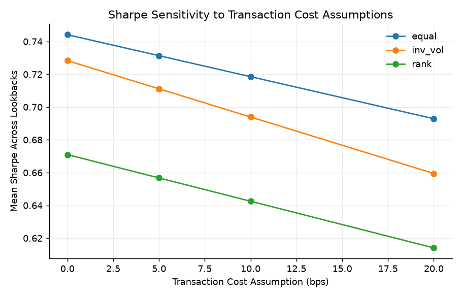

# Cross-Sectional ETF Momentum Signal — Research & Backtest

A systematic momentum strategy across a liquid, multi-asset ETF universe:
rank ETFs on trailing (12-1) returns, rebalance monthly into the top
decile, and evaluate it net of transaction costs against passive
benchmarks — with a robustness sweep across lookback windows, weighting
rules, and cost assumptions.

- **Signal:** cross-sectional 12-1 momentum (Jegadeesh & Titman, 1993 convention)
- **Universe:** 22 liquid ETFs across US/international equity, sectors, rates, credit, commodities, real estate
- **Rebalance:** monthly, top-6 holdings, three weighting rules (equal / rank-weighted / inverse-vol)
- **Costs:** turnover-aware, parameterized in basis points
- **Evaluation:** CAGR, annualized vol, Sharpe, Sortino, max drawdown, Calmar, hit rate, turnover
- **Robustness:** 4 lookback windows × 3 weighting rules × 4 cost assumptions (48 combinations) + in-sample/out-of-sample split + a pooled predictive regression with Newey-West standard errors

## Results (baseline: 12-1 signal, top-6, equal-weighted, 10bps cost)

| Metric | Momentum (net) | Momentum (gross) | Equal-Weight Universe | SPY Buy & Hold |
|---|---:|---:|---:|---:|
| CAGR | **19.8%** | 20.0% | 6.2% | 10.1% |
| Ann. Vol | 18.2% | 18.2% | 16.6% | 22.8% |
| Sharpe | **1.09** | 1.10 | 0.45 | 0.54 |
| Sortino | 1.70 | 1.71 | 0.64 | 0.80 |
| Max Drawdown | -27.8% | -27.7% | -36.4% | -64.0% |
| Calmar | 0.71 | 0.72 | 0.17 | 0.16 |
| Hit Rate | 63.9% | 63.9% | 57.1% | 59.2% |
| Ann. Turnover | 171% | 171% | — | — |

*(Regenerate this table any time with `python scripts/run_backtest.py` → `results/tables/baseline_summary.csv`)*





## Robustness

Sharpe ratio across the full lookback × weighting-rule grid at a 10bps
cost assumption — the point isn't that one cell is the "best," it's that
performance holds up across a neighborhood of reasonable parameter choices
rather than being a single overfit spike:



The top combinations by Sharpe all cluster around 9-12 month lookbacks
with rank-based weighting — directionally consistent rather than one
lucky cell:

| lookback | weighting | cost (bps) | CAGR | Sharpe | Max DD | Ann. Turnover |
|---:|---|---:|---:|---:|---:|---:|
| 12 | rank | 0 | 25.6% | 1.35 | -19.5% | 215% |
| 12 | rank | 10 | 25.3% | 1.34 | -19.7% | 215% |
| 9 | rank | 0 | 26.4% | 1.34 | -21.7% | 271% |
| 12 | rank | 20 | 25.0% | 1.33 | -19.8% | 215% |

Sharpe degrades gradually (not catastrophically) as assumed transaction
costs rise from 0 to 20bps, across every weighting rule:



**In-sample vs. out-of-sample** (baseline config, split at the sample
midpoint) — Sharpe is actually slightly higher out-of-sample (1.16 vs.
1.04), a reasonable stability check though not a substitute for genuine
walk-forward validation on live data:

| Metric | In-Sample | Out-of-Sample |
|---|---:|---:|
| CAGR | 20.8% | 18.8% |
| Sharpe | 1.04 | 1.16 |
| Max Drawdown | -21.1% | -27.8% |

A supplementary diagnostic (`src/robustness.py::predictive_regression`)
pools all (asset, month) observations and regresses next-month return on
the current momentum signal with Newey-West (HAC) standard errors, via
`statsmodels` — a check on the raw signal's predictive power independent
of any specific portfolio construction. Runs automatically in
`scripts/run_backtest.py` if `statsmodels` is installed.

## Methodology notes

- **12-1 construction:** the trailing return is measured with a 1-month
  skip immediately before the rebalance date, to avoid the well-documented
  short-term reversal effect leaking into a "momentum" signal.
- **No lookahead:** weights decided at month *t* are applied to the return
  realized in month *t+1* (see the timing convention documented at the top
  of `src/backtest.py`); transaction costs are charged against the same
  period the trade's turnover was measured in.
- **Turnover:** one-way turnover per rebalance = `sum(|Δweight|) / 2`;
  transaction cost = `turnover × cost_bps`.
- **Weighting rules:** `equal` (1/N across holdings), `rank` (weight
  proportional to cross-sectional signal rank among holdings — tilts
  toward the strongest names), `inv_vol` (equal selection, sized inversely
  to trailing realized volatility — a simple risk-parity sleeve).

## Data: how this repo runs offline, and how to use real market data

This repo ships with a **synthetic, factor-model-generated** monthly price
history (`data/etf_prices.csv`, `scripts/generate_sample_data.py`) so it
clones and runs end-to-end with zero API keys and no network dependency —
useful for CI, for reviewers, and for reproducing the exact numbers above.
It is clearly not live market data.

To backtest on **real** ETF history:

```bash
python -c "from src.data_loader import load_prices; load_prices(refresh=True)"
```

This requires `pip install yfinance` and an internet connection. It
overwrites `data/etf_prices.csv` with live Yahoo Finance history, and
every script/notebook downstream picks it up automatically — re-run
`python scripts/run_backtest.py` afterward to regenerate all figures and
tables against real data.

## Repo structure

```
etf-momentum-strategy/
├── README.md
├── requirements.txt
├── src/
│   ├── data_loader.py      # yfinance fetch + offline cache fallback
│   ├── signal.py            # trailing-return momentum signal, ranking, vol
│   ├── portfolio.py         # top-N selection, 3 weighting schemes, turnover
│   ├── backtest.py          # signal -> weights -> net returns, benchmarks
│   ├── metrics.py           # CAGR, Sharpe, Sortino, drawdown, Calmar, ...
│   └── robustness.py        # parameter grid, IS/OOS split, HAC regression
├── scripts/
│   ├── generate_sample_data.py  # builds the offline synthetic dataset
│   └── run_backtest.py          # end-to-end driver -> results/
├── notebooks/
│   └── momentum_backtest_analysis.ipynb   # narrative walkthrough
├── tests/
│   ├── test_signal.py
│   ├── test_portfolio.py
│   ├── test_metrics.py
│   └── test_backtest.py
├── data/
│   └── etf_prices.csv       # offline synthetic sample (see above)
└── results/
    ├── figures/              # PNGs referenced above
    └── tables/                # CSVs backing every table above
```

## Running it

```bash
python -m venv .venv && source .venv/bin/activate   # optional but recommended
pip install -r requirements.txt

# Full pipeline: baseline backtest, benchmarks, robustness grid, figures/tables
python scripts/run_backtest.py

# Interactive walkthrough
jupyter notebook notebooks/momentum_backtest_analysis.ipynb

# Unit tests
pytest tests/ -v
```

## Limitations

- No borrow costs, shorting, or leverage — long-only.
- Transaction costs are a flat bps-of-turnover assumption, not a market-impact model.
- The 22-ETF universe and its liquidity are assumed static over the sample; no survivorship-bias adjustment (irrelevant for this ETF set, but worth flagging as a general backtesting caveat).
- Offline results use synthetic data calibrated to plausible asset-class drift/vol/correlation, not fitted to any specific historical sample — see [Data](#data-how-this-repo-runs-offline-and-how-to-use-real-market-data) above for reproducing on real history.
